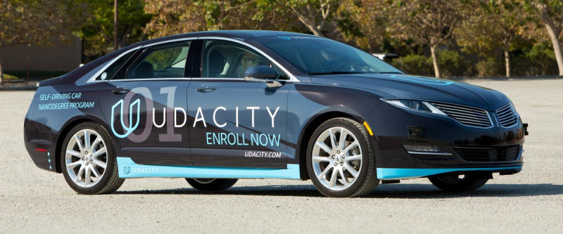

## Self-Driving Car Nanodegree Capstone Project

<center>**CAR-X** Team</center>

### Overview

The System Integration project is the final project of the Udacity Self-Driving Car Engineer Nanodegree.

The goal of this project is to code a real self-driving car to drive itself on a test track using [ROS](http://www.ros.org/) and [Autoware](https://github.com/CPFL/Autoware). The project is coded to run on Udacity simulator as well as on Udacity's own self-driving car [CARLA](https://medium.com/udacity/how-the-udacity-self-driving-car-works-575365270a40).



As a team, we built ROS nodes to implement core functionality of the autonomous vehicle system, including traffic light detection, control, and waypoint following.

For more information about the project, see the project introduction [here](https://classroom.udacity.com/nanodegrees/nd013/parts/6047fe34-d93c-4f50-8336-b70ef10cb4b2/modules/e1a23b06-329a-4684-a717-ad476f0d8dff/lessons/462c933d-9f24-42d3-8bdc-a08a5fc866e4/concepts/5ab4b122-83e6-436d-850f-9f4d26627fd9).

### Architecture

Using the Robot Operating System (ROS), each team member has developed and maintained a core component of the infrastructure that is demanded by the autonomous vehicle. The three core components of any good robot are the following:

- Perception: Sensing the environment to perceive obstacles, traffic hazards as well as traffic lights and road signs.

- Planning: Route planning to a given goal state using data from localization, perception and environment maps.

- Control: Actualising trajectories formed as part of planning, in order actuate the vehicle, through steering, throttle and brake commands.


### Installation

* Be sure that your workstation is running Ubuntu 16.04 Xenial Xerus or Ubuntu 14.04 Trusty Tahir. [Ubuntu downloads can be found here](https://www.ubuntu.com/download/desktop).
* If using a Virtual Machine to install Ubuntu, use the following configuration as minimum:
  * 2 CPU
  * 2 GB system memory
  * 25 GB of free hard drive space

  The Udacity provided virtual machine has ROS and Dataspeed DBW already installed, so you can skip the next two steps if you are using this.

* Follow these instructions to install ROS
  * [ROS Kinetic](http://wiki.ros.org/kinetic/Installation/Ubuntu) if you have Ubuntu 16.04.
  * [ROS Indigo](http://wiki.ros.org/indigo/Installation/Ubuntu) if you have Ubuntu 14.04.
* [Dataspeed DBW](https://bitbucket.org/DataspeedInc/dbw_mkz_ros)
  * Use this option to install the SDK on a workstation that already has ROS installed: [One Line SDK Install (binary)](https://bitbucket.org/DataspeedInc/dbw_mkz_ros/src/81e63fcc335d7b64139d7482017d6a97b405e250/ROS_SETUP.md?fileviewer=file-view-default)
* Download the [Udacity Simulator](https://github.com/udacity/CarND-Capstone/releases/tag/v1.2).

### Sections

- **Waypoint Updater and Publisher** Node:
  - subscribes to `/base_waypoints` and `/current_pose` and publishes to `/final_waypoints`.
  - Once you have correctly identified the traffic light and determined its position, you can convert it to a waypoint index and publish it.
  - Use `/traffic_waypoint` to change the waypoint target velocities before publishing to `/final_waypoints`.

- **DBW** Node: Once your waypoint updater is publishing `/final_waypoints`, the waypoint_follower node will start publishing messages to `the/twist_cmd` topic. At this point, you have everything needed to build the `dbw_node`. After completing this step, the car should drive in the simulator, ignoring the traffic lights.

- **Traffic Light Detection and Classifier**:
  - Detection: Detect the traffic light and its color from the `/image_color`. The topic `/vehicle/traffic_lights` contains the exact location and status of all traffic lights in simulator, so you can test your output.
  - Classifier:


### Roadmap

  - Build the nodes described
  - Testing with the provided simulator
  - Upload a video sample
  - Update the README file to include the details

### Contribution

Each of the four team members in `Car-X` team should handle a sections.

Assuming `Eqbal` is handling the `dbw_node`:

- Create a branch with the first two name initiative followed by the section name: `git checkout -b eq-dbw_node`

- Commit the changes (better to have many comments with description description rather than one long commit)

- Once you are stuck push your branch so everyone in the team can check out the updates ( *don't push the code all together once you are done but rather than incrementally keep pushing changes* ): `git push -u origin eq-dbw_node`

- For testing please keep your python notebooks inside `./notebooks` folder.

- Please don't apply the changes directly to `master`

### Task break down table
To break down tasks and manage our task we'll be using [Github Project management](https://github.com/marketplace/category/project-management) check out the link below:

https://github.com/eqbal/CarND_Capstone_CarX/projects/1

### Team Members:

  - [Eqbal Quran](www.eqbalq.com) (info@eqbalq.com)

	> Eki has already written a book about Ruby 5.0. It’s currently
sealed up. In three years, Matz is going to open the book to see if the
language design team got it right.

  - Jaime Blasco (pinoch0@gmail.com)
	> Jaime's addition operator doesn't commute; it teleports to
where he needs it to be

  - Dimitrios Mavridis (dmavridis@gmail.com)

	> Dimitrios's code doesn't follow a coding convention. It is the coding convention.
	
  - Mani Srinivasan (srnimani@gmail.com)
	> Mani does not use revision control software. None of his code has ever needed revision.

  - Volodymyr Seliuchenko (volodymyr.seliuchenko@gmail.com)
	> Volodymyr's coding reputation is only as modest as it is because of integer overflow (SQL Server does not have a datatype large enough)


### Usage

1. Clone the project repository
```bash
git clone https://github.com/udacity/CarND-Capstone.git
```

2. Install python dependencies
```bash
cd CarND-Capstone
pip install -r requirements.txt
```
3. Make and run styx
```bash
cd ros
catkin_make
source devel/setup.sh
roslaunch launch/styx.launch
```
4. Run the simulator

### Real world testing
1. Download [training bag](https://drive.google.com/file/d/0B2_h37bMVw3iYkdJTlRSUlJIamM/view?usp=sharing) that was recorded on the Udacity self-driving car
2. Unzip the file
```bash
unzip traffic_light_bag_files.zip
```
3. Play the bag file
```bash
rosbag play -l traffic_light_bag_files/loop_with_traffic_light.bag
```
4. Launch your project in site mode
```bash
cd CarND-Capstone/ros
roslaunch launch/site.launch
```

