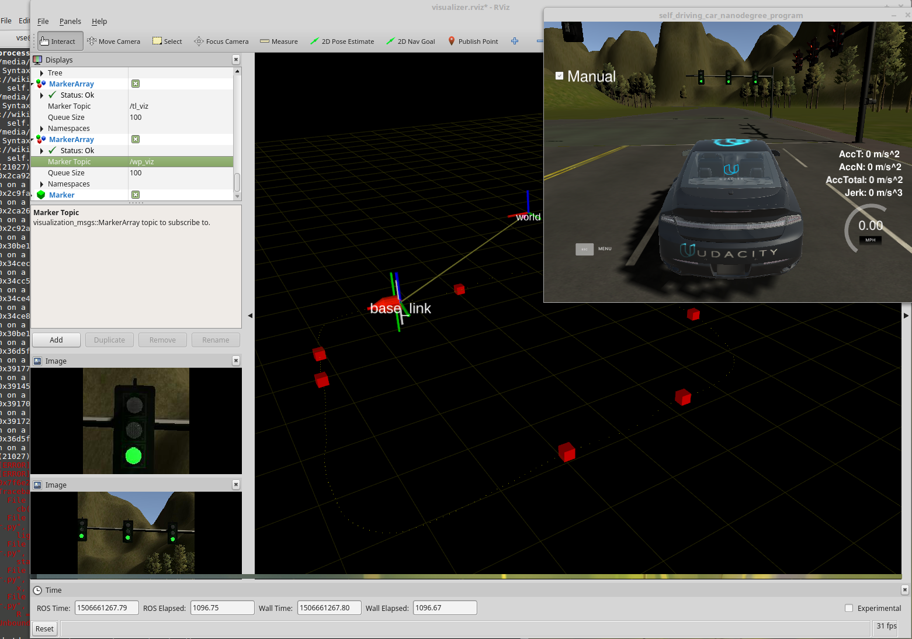

# Visualization module #

To facilitate debugging of the system a visualization module was created for RVIZ. Information about waypoints, car location, upcoming stop light and also traffic light and their status - red, yellow or green. The screenshot below is an example of RVIZ debugging session:




# Traffic light detector #

## Street light waypoint detection ##

The closest waypoint is found using shortest distance criteria. After the nearest TL is found, it is checked if we passed it by looking at the angle between the car's heading vector and a vector pointing from the car the TL location. The angle is found from the scalar product of these two vectors. If this angle is greater than pi/2, the stopline is considered to be passed and the corresponding stopline waypoint is not published anymore.

```python

    # let's use scalar product to find the angle between the car orientation vector and car/base_point vector
    car_orientation = p_q * PyKDL.Vector(1.0, 0.0, 0.0)
    wp_vector = PyKDL.Vector(wpt.pose.pose.position.x-pose.position.x,
                            wpt.pose.pose.position.y-pose.position.y, 0.0)

    cos_angle = PyKDL.dot(car_orientation, wp_vector)/car_orientation.Norm()/wp_vector.Norm()
    angle = np.arccos(cos_angle)

    if direction == 'F':
        if angle < np.pi/2.0:
            best_distance = distance
            best_angle = angle
            best_i = i
    if direction == 'R':
        if angle > np.pi/2.0:
            best_distance = distance
            best_angle = angle
            best_i = i
```

## TL projection to the image##

The projection was done in 2 stages:
- changing the TL coordinate system from global to car's local one:
```python
        piw = PyKDL.Vector(point_in_world.x,point_in_world.y,point_in_world.z)
        R = PyKDL.Rotation.Quaternion(*rot)
        T = PyKDL.Vector(*trans)
        p_car = R*piw+T
```
- using a pinhole camera model to project the TL location onto the image plain.

```python
        f = 2300
        x_offset = -30
        y_offset = 340
        fx = f
        fy = f

        x = -p_car[1]/p_car[0]*fx+image_width/2 + x_offset
        y = -p_car[2]/p_car[0]*fx+image_height/2+y_offset

        return (int(x), int(y))
```

The focal distance and offset pinhole model parameters were tuned to match the TL with its image. For the tuning, the pinhole project properties were utilized: the offsets were selected to match the TL coordinate to its image when the car was far away from the TL and the focal length was tuned for closer TL positions.

Finally, the image is cropped around the found TF projection to simplify the classification task.

## Classifier ##

Knowing the coordinates of the traffic light in the world coordinate system together with accurate transformation for the car coordinate system makes the traffic detection problem trivial. In the project, the classification is done based on the color - the traffic light colors are very saturated what makes it easy to detect the state on the background. In real conditions, a more intelligent classifier should be used (e.g. a neural network similar to YOLO or SSD, or a fully convolutional network)

```python
        hsv_img = cv2.cvtColor(image,cv2.COLOR_BGR2HSV)
        #red
        RED_MIN = np.array([0, 120, 120],np.uint8)
        RED_MAX = np.array([10, 255, 255],np.uint8)
        frame_threshed = cv2.inRange(hsv_img, RED_MIN, RED_MAX)
        r = cv2.countNonZero(frame_threshed)
        if r > 50:
            return TrafficLight.RED

        YELLOW_MIN = np.array([40.0/360*255, 120, 120],np.uint8)
        YELLOW_MAX = np.array([66.0/360*255, 255, 255],np.uint8)
        frame_threshed = cv2.inRange(hsv_img, YELLOW_MIN, YELLOW_MAX)
        y = cv2.countNonZero(frame_threshed)
        if y > 50:
            return TrafficLight.YELLOW

        GREEN_MIN = np.array([90.0/360*255, 120, 120],np.uint8)
        GREEN_MAX = np.array([140.0/360*255, 255, 255],np.uint8)
        frame_threshed = cv2.inRange(hsv_img, GREEN_MIN, GREEN_MAX)
        g = cv2.countNonZero(frame_threshed)
        if g > 50:
            return TrafficLight.GREEN

        # import ipdb; ipdb.set_trace()

        return TrafficLight.UNKNOWN
```
